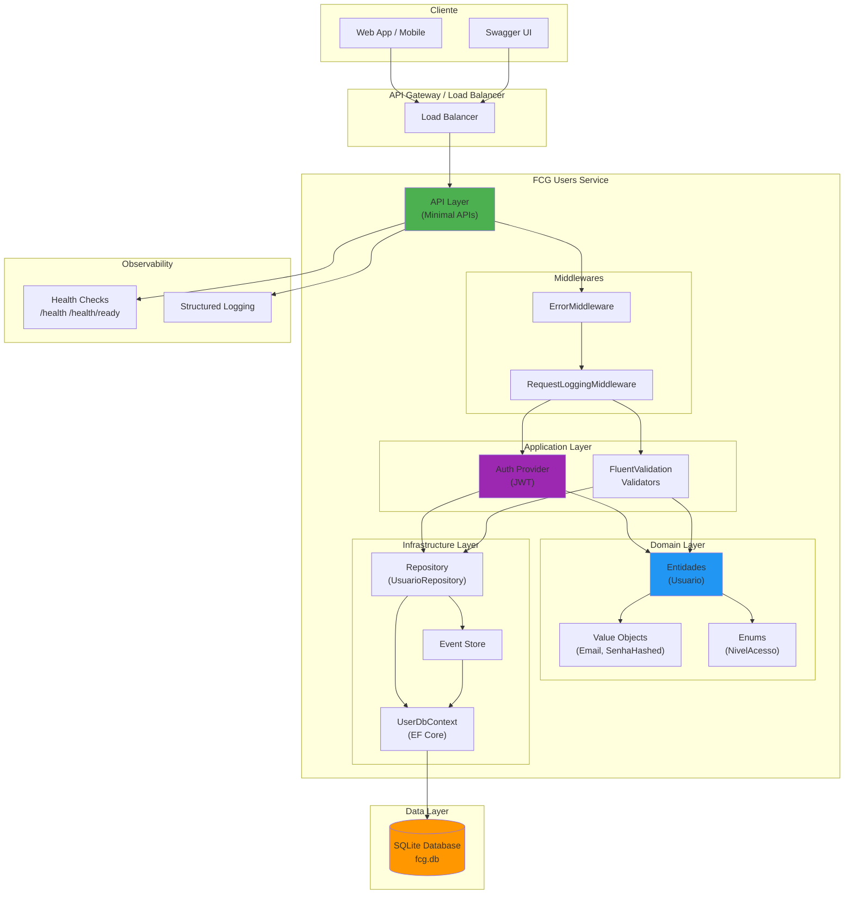
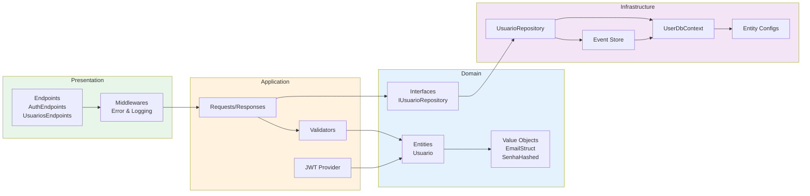
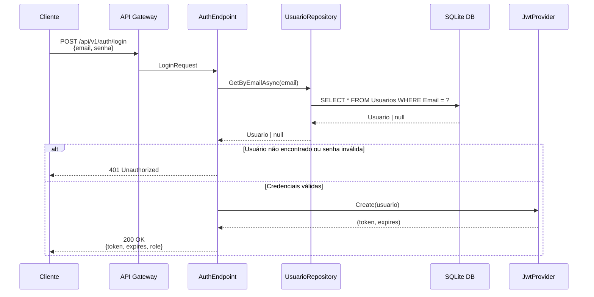
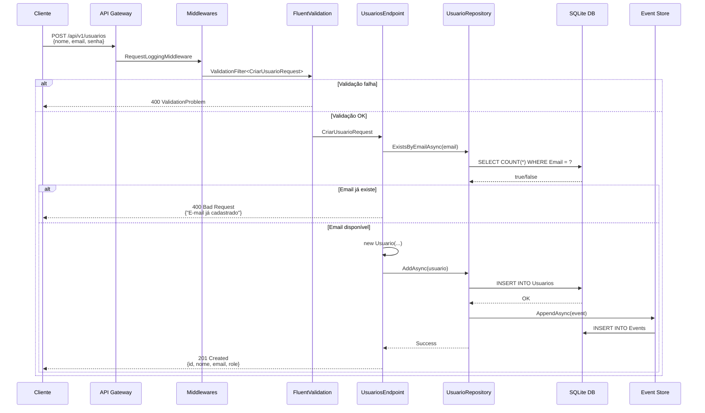
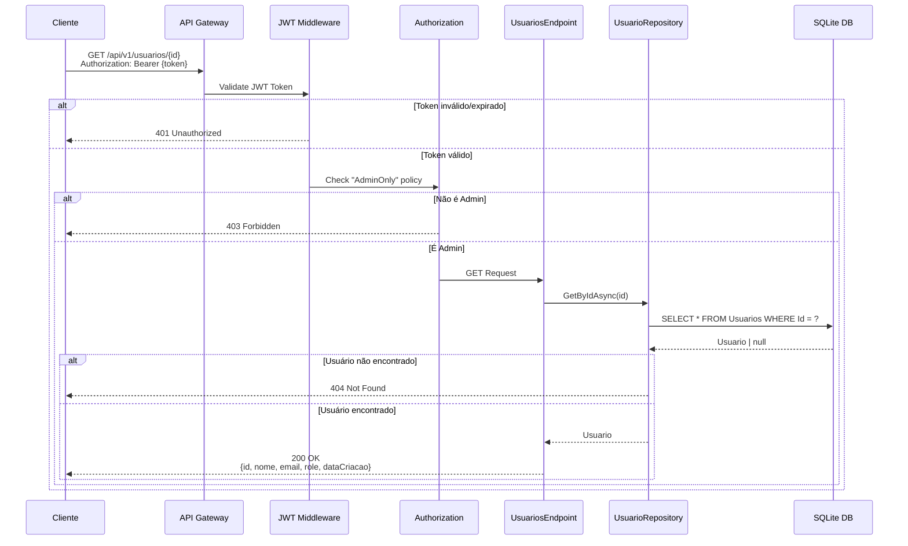
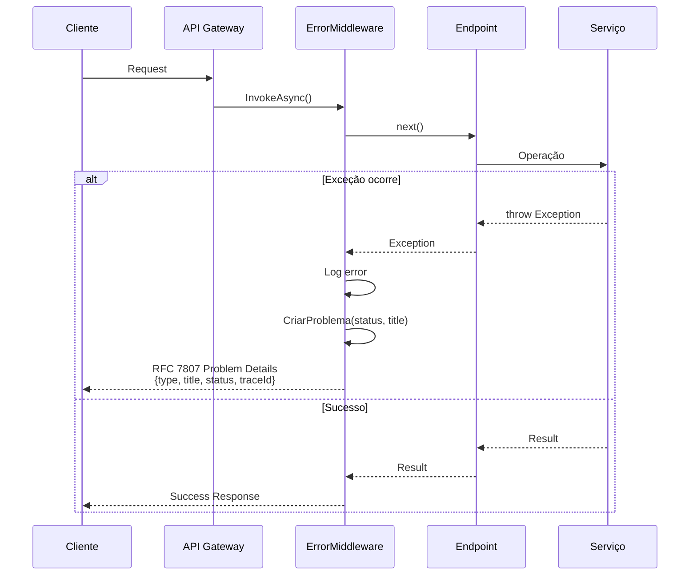

# FIAP Cloud Games - Serviço de Usuários

[](https://dotnet.microsoft.com/)
[](https://azure.microsoft.com/services/container-apps/)
[](LICENSE)
[](https://github.com/gustavo4869/fcg-users-service/actions)

> **MVP – Microsserviço de Cadastro e Autenticação de Usuários**

API RESTful desenvolvida em **.NET 10** para gerenciamento de usuários com autenticação JWT, seguindo princípios de Clean Architecture e Domain-Driven Design (DDD).

---

## 📋 Sumário

- [Visão Geral](#-visão-geral)
- [Arquitetura](#-arquitetura)
- [Tecnologias](#-tecnologias)
- [Funcionalidades](#-funcionalidades)
- [Estrutura do Projeto](#-estrutura-do-projeto)
- [Fluxo de Comunicação](#-fluxo-de-comunicação)
- [Pré-requisitos](#-pré-requisitos)
- [Instalação e Execução](#-instalação-e-execução)
- [Endpoints da API](#-endpoints-da-api)
- [Autenticação e Autorização](#-autenticação-e-autorização)
- [Docker](#-docker)
- [Health Checks](#-health-checks)
- [Event Sourcing](#-event-sourcing)
- [Variáveis de Ambiente](#-variáveis-de-ambiente)
- [Validações](#-validações)
- [Segurança](#-segurança)

---

## 🎯 Visão Geral

O **FCG Users Service** é um microsserviço responsável pelo gerenciamento completo do ciclo de vida de usuários na plataforma FIAP Cloud Games. Este serviço oferece:

- ✅ Cadastro de usuários com validação robusta
- 🔐 Autenticação via JWT (JSON Web Tokens)
- 👥 Gerenciamento de níveis de acesso (Usuário e Administrador)
- 📊 Health checks para monitoramento
- 🔒 Criptografia de senhas com BCrypt
- 📝 Logging estruturado com correlação de requisições
- 🎯 Event Sourcing para auditoria

---

## 🏗️ Arquitetura

### Diagrama de Arquitetura do Sistema



### Diagrama de Camadas (Clean Architecture)



---

## 🛠️ Tecnologias

| Categoria | Tecnologia | Versão |
|-----------|-----------|--------|
| **Framework** | .NET | 10.0 |
| **API** | ASP.NET Core Minimal APIs | 10.0 |
| **Database** | SQLite | - |
| **ORM** | Entity Framework Core | 10.0 |
| **Autenticação** | JWT Bearer | - |
| **Validação** | FluentValidation | 11.x |
| **Documentação** | Swagger/OpenAPI | 3.0 |
| **Hashing** | BCrypt.Net | - |
| **Container** | Docker | - |
| **Logging** | Microsoft.Extensions.Logging | - |

---

## ⚡ Funcionalidades

### Módulo de Autenticação
- 🔑 Login com email/senha
- 🎫 Geração de JWT com claims personalizadas
- ⏰ Tokens com expiração configurável (padrão: 60 minutos)

### Módulo de Usuários
- ➕ Cadastro de novos usuários
- 🔍 Consulta de usuários (Admin only)
- ✏️ Atualização de dados (Admin only)
- ❌ Exclusão de usuários (Admin only)
- 🛡️ Proteção contra auto-exclusão

### Recursos Avançados
- 📊 Health checks (live + ready)
- 📝 Logging estruturado com mascaramento de dados sensíveis
- 🔄 Correlation ID para rastreamento de requisições
- 🎯 Event Sourcing para auditoria
- 🚫 Tratamento global de erros (RFC 7807)

---

## 📁 Estrutura do Projeto

```
Fcg.Users.Api/
├── Api/
│   ├── Endpoints/
│   │   ├── AuthEndpoints.cs          # Endpoints de autenticação
│   │   ├── UsuariosEndpoints.cs      # Endpoints de usuários
│   │   └── ValidationFilter.cs        # Filtro de validação
│   └── Middleware/
│       ├── ErrorMiddleware.cs         # Tratamento de erros global
│       └── RequestLoggingMiddleware.cs # Logging de requisições
│
├── Application/
│   ├── Auth/
│   │   ├── Provider/
│   │   │   ├── IJwtProvider.cs        # Interface JWT
│   │   │   └── JwtProvider.cs         # Implementação JWT
│   │   ├── Request/
│   │   │   └── LoginRequest.cs        # DTO de login
│   │   └── Response/
│   │       └── AuthResponse.cs        # DTO de resposta JWT
│   └── Usuarios/
│       ├── Request/
│       │   ├── CriarUsuarioRequest.cs
│       │   └── AtualizarUsuarioRequest.cs
│       ├── Response/
│       │   ├── UsuarioResponse.cs
│       │   └── UsuarioCriadoResponse.cs
│       └── Validator/
│           ├── CriarUsuarioValidator.cs
│           └── AtualizarUsuarioValidator.cs
│
├── Domain/
│   ├── Entidades/
│   │   └── Usuario.cs                 # Entidade de domínio
│   ├── Enum/
│   │   └── NivelAcessoEnum.cs         # Enum de níveis de acesso
│   └── Shared/
│       ├── EmailStruct.cs             # Value Object Email
│       └── SenhaHashed.cs             # Value Object Senha
│
├── Infra/
│   ├── Configs/
│   │   ├── UsuarioConfig.cs           # Configuração EF Core
│   │   └── EventEntityConfig.cs       # Configuração Event Store
│   ├── Events/
│   │   ├── EventEntity.cs             # Entidade de evento
│   │   └── IEventStore.cs             # Interface Event Store
│   ├── Repository/
│   │   ├── IUsuarioRepository.cs      # Interface do repositório
│   │   └── UsuarioRepository.cs       # Implementação
│   ├── UserDbContext.cs               # Contexto EF Core
│   └── Migrations/                    # Migrações do banco
│
├── Setup/
│   ├── ServiceCollectionExtensions.cs # Configuração DI
│   └── WebApplicationExtensions.cs    # Configuração Pipeline
│
├── Contratos/
│   └── Responses/
│       └── CommonResponses.cs         # Respostas comuns
│
├── Program.cs                         # Entry point
├── appsettings.json                   # Configurações
├── Dockerfile                         # Container Docker
└── Fcg.Users.Api.csproj              # Projeto .NET
```

---

## 🔄 Fluxo de Comunicação

### Fluxo de Autenticação (Login)



### Fluxo de Cadastro de Usuário



### Fluxo de Consulta Protegida (Admin Only)



### Fluxo de Tratamento de Erros



---

## 📋 Pré-requisitos

- [.NET 10 SDK](https://dotnet.microsoft.com/download/dotnet/10.0)
- [Docker](https://www.docker.com/get-started) (opcional, para containerização)
- [Visual Studio 2022+](https://visualstudio.microsoft.com/) ou [VS Code](https://code.visualstudio.com/)

---

## 🚀 Instalação e Execução

### Modo Desenvolvimento (Local)

1. **Clone o repositório:**
   ```bash
   git clone https://github.com/gustavo4869/fcg-users-service.git
   cd fcg-users-service
   ```

2. **Restaure as dependências:**
   ```bash
   dotnet restore
   ```

3. **Aplique as migrações do banco de dados:**
   ```bash
   cd Fcg.Users.Api
   dotnet ef database update
   ```

4. **Execute a aplicação:**
   ```bash
   dotnet run
   ```

5. **Acesse a documentação Swagger:**
   ```
   https://localhost:8081/swagger
   ```

### Usuário Padrão (Desenvolvimento)

Em ambiente de desenvolvimento, um usuário administrador é criado automaticamente:

- **Email:** `admin@fcg.com`
- **Senha:** `Admin@123`
- **Nível:** Administrador

---

## 📡 Endpoints da API

### Base URL
```
https://localhost:8081/api/v1
```

### Autenticação

#### Login
```http
POST /auth/login
Content-Type: application/json

{
  "email": "admin@fcg.com",
  "senha": "Admin@123"
}
```

**Resposta (200 OK):**
```json
{
  "token": "eyJhbGciOiJIUzI1NiIsInR5cCI6IkpXVCJ9...",
  "expires": "2026-01-09T15:30:00Z",
  "role": "Administrador"
}
```

---

### Usuários

#### Criar Usuário
```http
POST /usuarios
Content-Type: application/json

{
  "nome": "João Silva",
  "email": "joao.silva@email.com",
  "senha": "Senha@123",
  "nivelAcesso": "usuario"
}
```

**Resposta (201 Created):**
```json
{
  "id": "3fa85f64-5717-4562-b3fc-2c963f66afa6",
  "nome": "João Silva",
  "email": "joao.silva@email.com",
  "nivelAcesso": "Usuario"
}
```

#### Listar Usuários (Admin)
```http
GET /usuarios
Authorization: Bearer {token}
```

**Resposta (200 OK):**
```json
[
  {
    "id": "3fa85f64-5717-4562-b3fc-2c963f66afa6",
    "nome": "João Silva",
    "email": "joao.silva@email.com",
    "nivelAcesso": "Usuario",
    "dataCriacao": "2026-01-09T10:00:00Z"
  }
]
```

#### Buscar Usuário por ID (Admin)
```http
GET /usuarios/{id}
Authorization: Bearer {token}
```

#### Atualizar Usuário (Admin)
```http
PUT /usuarios/{id}
Authorization: Bearer {token}
Content-Type: application/json

{
  "nome": "João Silva Jr.",
  "email": "joao.jr@email.com",
  "nivelAcesso": "admin"
}
```

#### Excluir Usuário (Admin)
```http
DELETE /usuarios/{id}
Authorization: Bearer {token}
```

**Resposta (204 No Content)**

**Proteção:** Não é possível excluir o próprio usuário autenticado.

---

## 🔐 Autenticação e Autorização

### JWT Claims

Os tokens JWT incluem as seguintes claims:

| Claim | Descrição | Exemplo |
|-------|-----------|---------|
| `sub` | ID do usuário | `3fa85f64-5717-4562-b3fc-2c963f66afa6` |
| `email` | Email do usuário | `admin@fcg.com` |
| `role` | Papel do usuário | `Admin` ou `User` |
| `jti` | ID único do token | `7c9e6679-7425-40de-944b-e07fc1f90ae7` |
| `exp` | Expiração do token | `1736438400` |

### Níveis de Acesso

| Nível | Valor | Permissões |
|-------|-------|------------|
| **Usuario** | `usuario` | Apenas criação de conta própria |
| **Administrador** | `admin` | CRUD completo de usuários |

### Políticas de Autorização

```csharp
[RequireAuthorization("AdminOnly")] // Apenas administradores
```

---

## 🐳 Docker

### Build da Imagem

```bash
docker build -t fcg-users-api:latest -f Fcg.Users.Api/Dockerfile .
```

### Executar Container

```bash
docker run -d \
  -p 8080:8080 \
  -p 8081:8081 \
  -e Jwt__Key="LHQ2+uXWaOMKwI+4h6gI9Zx7tkdUONRMkWa3eAKQxkv0CQLtaUOwZzPqcJ27jsgV" \
  --name fcg-users-api \
  fcg-users-api:latest
```

### Docker Compose (Exemplo)

```yaml
version: '3.8'

services:
  fcg-users-api:
    build:
      context: .
      dockerfile: Fcg.Users.Api/Dockerfile
    ports:
      - "8080:8080"
      - "8081:8081"
    environment:
      - ASPNETCORE_ENVIRONMENT=Production
      - Jwt__Key=${JWT_SECRET_KEY}
      - ConnectionStrings__DefaultConnection=Data Source=/app/data/fcg.db
    volumes:
      - ./data:/app/data
    healthcheck:
      test: ["CMD", "curl", "-f", "http://localhost:8080/health"]
      interval: 30s
      timeout: 10s
      retries: 3
      start_period: 40s
```

---

## 🏥 Health Checks

### Endpoints de Saúde

#### Liveness Probe
```http
GET /health
```

**Resposta (200 OK):**
```
Healthy
```

#### Readiness Probe
```http
GET /health/ready
```

**Resposta (200 OK):**
```json
{
  "status": "Healthy",
  "checks": [
    {
      "name": "efcore-db",
      "status": "Healthy",
      "error": null
    }
  ]
}
```

### Kubernetes Health Check Config

```yaml
livenessProbe:
  httpGet:
    path: /health
    port: 8080
  initialDelaySeconds: 30
  periodSeconds: 10

readinessProbe:
  httpGet:
    path: /health/ready
    port: 8080
  initialDelaySeconds: 10
  periodSeconds: 5
```

---

## 📊 Event Sourcing

O sistema implementa Event Sourcing para auditoria de eventos de domínio.

### Estrutura de Evento

```csharp
public sealed class EventEntity
{
    public Guid EventId { get; set; }
    public Guid AggregateId { get; set; }        // ID do usuário
    public string EventType { get; set; }         // Tipo do evento
    public DateTime OccurredAt { get; set; }      // Timestamp
    public int Version { get; set; }              // Versão do agregado
    public Guid? CorrelationId { get; set; }      // Rastreamento
    public string Payload { get; set; }           // Dados JSON
}
```

### Tipos de Eventos

- `UsuarioCriado`
- `UsuarioAtualizado`
- `UsuarioExcluido`
- `UsuarioAutenticado`

---

## ⚙️ Variáveis de Ambiente

| Variável | Descrição | Padrão | Obrigatório |
|----------|-----------|--------|-------------|
| `ASPNETCORE_ENVIRONMENT` | Ambiente de execução | `Development` | Não |
| `Jwt__Key` | Chave secreta JWT (mín. 32 bytes) | - | ✅ Sim |
| `Jwt__Issuer` | Emissor do token | - | Não |
| `Jwt__Audience` | Audiência do token | - | Não |
| `ConnectionStrings__DefaultConnection` | String de conexão SQLite | `Data Source=fcg.db` | Não |

### Exemplo de appsettings.json

```json
{
  "Logging": {
    "LogLevel": {
      "Default": "Information",
      "Microsoft.AspNetCore": "Warning"
    }
  },
  "AllowedHosts": "*",
  "Jwt": {
    "Key": "LHQ2+uXWaOMKwI+4h6gI9Zx7tkdUONRMkWa3eAKQxkv0CQLtaUOwZzPqcJ27jsgV"
  },
  "ConnectionStrings": {
    "DefaultConnection": "Data Source=fcg.db"
  }
}
```

---

## ✅ Validações

### Senha Forte

A senha deve conter:
- ✅ Mínimo 8 caracteres
- ✅ Pelo menos uma letra (maiúscula ou minúscula)
- ✅ Pelo menos um número
- ✅ Pelo menos um caractere especial

Exemplos válidos:
- `Senha@123`
- `MyP@ssw0rd`
- `Secure#2026`

### Email

- ✅ Formato válido (regex: `^[^@\s]+@[^@\s]+\.[a-zA-Z]{2,}$`)
- ✅ Normalizado (lowercase)
- ✅ Único no sistema

### Nome

- ✅ Não pode ser vazio
- ✅ Máximo 120 caracteres

---

## 🔒 Segurança

### Implementações de Segurança

1. **Hashing de Senhas**
   - Algoritmo: BCrypt
   - Salt automático
   - Verificação segura

2. **JWT Seguro**
   - Assinatura HMAC-SHA256
   - Validação de chave mínima (32 bytes)
   - Claims customizadas

3. **Proteção de Dados Sensíveis**
   - Mascaramento de senhas nos logs
   - Não exposição de hashes em respostas
   - HTTPS obrigatório em produção

4. **Validação de Entrada**
   - FluentValidation em todas as requisições
   - Sanitização de emails
   - Proteção contra SQL Injection (EF Core)

5. **Políticas de Autorização**
   - Role-based access control (RBAC)
   - Proteção de endpoints administrativos
   - Prevenção de auto-exclusão

---

## 📄 Licença

Este projeto está sob a licença MIT. Veja o arquivo `LICENSE` para mais detalhes.

---

## 📞 Contato

**FIAP Cloud Games Team**

- Repositório: [https://github.com/gustavo4869/fcg-users-service](https://github.com/gustavo4869/fcg-users-service)
- Issues: [https://github.com/gustavo4869/fcg-users-service/issues](https://github.com/gustavo4869/fcg-users-service/issues)

---

**Desenvolvido com ❤️ usando .NET 10**
